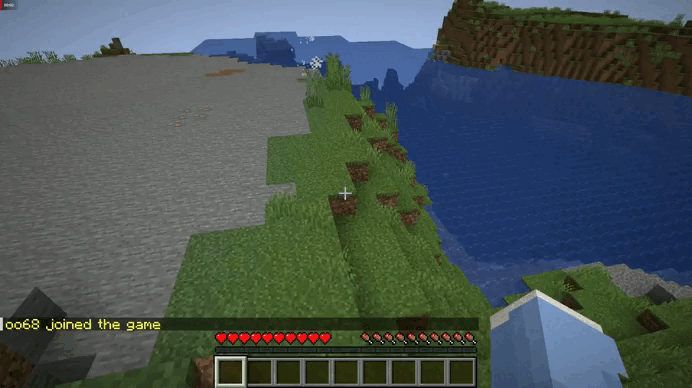

> # DeathStep
Minecraft plugin which implements death when Player stepping on specific block!

## How to install?

- First of all, clone the current repo with proceed code below.
``
	git clone https://github.com/viamane/DeathStep.git
``
``
	 cd DeathStep
``

- Now, open your terminal and make sure it follows DeathStep **path**.
- After, you can execute the following command below into your terminal:

 	 	mvn clean package

Otherwise, you can use already **pre-compiled** .jar file, its located in the **project folder**!

## How to run?

- **NOTE** This project **currently** supports only **[PaperMC](https://papermc.io/)**, also this project tested in 1.20.1 version, so i don't know about others.

- Please consider **[PaperMC documentaries](https://docs.papermc.io/paper)** to setup your server.

## Config
- The config file are located in the .resources folder.
- To correctly use it, look at these [ENUMS]([https://jd.papermc.io/paper/1.21.1/org/bukkit/Material.html](https://jd.papermc.io/paper/1.21.1/org/bukkit/Material.html)).

## Have an issue?
- Open an **issue** or contact to me on **Telegram**/**Discord**: *@viamanee* | *nolegitplayer*

### Satisfied about the project?
- Put the 🌟.
